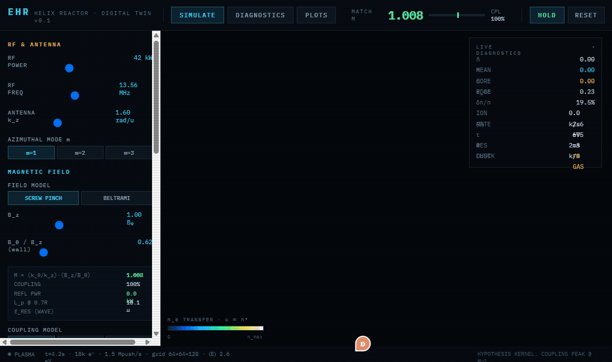
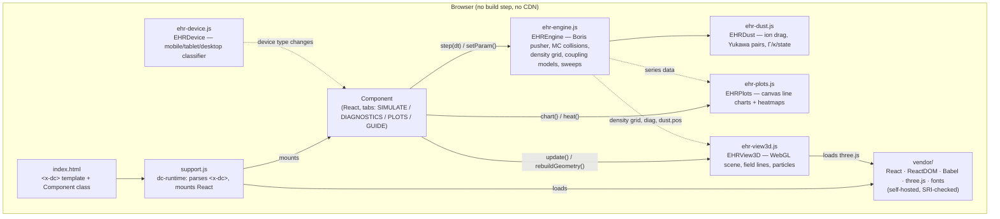

# EHR — Electromagnetic Helix Reactor

A reduced-physics **digital twin of a helical-antenna plasma reactor**, running entirely in the browser: ~18k macro-electrons pushed through an analytic magnetic field with a Boris integrator, Monte-Carlo collisions with neutral gas, a live 3D render, synthetic diagnostics, and a dusty-plasma (plasma crystal) module.

The question under test: an RF antenna launches a helical wave with pitch `k_θ/k_z`; the magnetic field lines twist with pitch `B_θ/B_z`. The **match number `M = (k_θ/k_z)·(B_z/B_θ)`** compares them. Hypothesis: coupling peaks when the two helices align, `M ≈ 1`. You can bake that in as a prior (KERNEL), or force it to emerge — or fail — from geometry alone (EMERGENT, WAVE).



## Paper

This simulator is the companion digital twin for the paper **"Electromagnetic Helix Reactor (EHR): A Multi-Physics Plasma Control Architecture for Advanced Plasma Processing"** (Zachary Auerbach). Source and compiled PDF: [`paper/ehr-paper.tex`](paper/ehr-paper.tex) / [`paper/ehr-paper.pdf`](paper/ehr-paper.pdf).

The paper grounds the proposed operating regime in Hall-parameter estimates (the B–p regime map is generated by [`paper/figures/regime_map.py`](paper/figures/regime_map.py)) and defines **four falsifiable predictions**: the m=1 helicon mode is measurable on a B-dot array, the helicon resonance produces a density peak, acoustic drive imprints on the plasma density, and pitch scans at constant |B| and power change the coupling. The simulator's DIAGNOSTICS instruments and M/f sweeps mirror those predictions one-for-one.

## Features

- **SIMULATE** — live 3D vessel (Three.js): field lines, electron cloud, density volume raymarch, isosurfaces, antenna, dust, wafer chuck. Drag to orbit, wheel to zoom.
- **DIAGNOSTICS** — six synthetic instruments: virtual Langmuir probes (core/edge density + radial profile), turbulence proxy (δn/n + Hann PSD), an 8-probe B-dot array that recovers the azimuthal mode via DFT, a synthetic GPI camera, axial structure vs. acoustic drive, and a wafer/dust panel with pair-correlation g(r).
- **PLOTS** — sweep `M` or RF frequency and trace the coupling response; overlay up to 4 stored runs color-coded by coupling model; export everything to CSV.
- **GUIDE** — a full in-app operator's manual.
- Three coupling models (**KERNEL** / **EMERGENT** / **WAVE**) so you can compare a hand-tuned prior against physics derived from `k̂·B̂` alignment and a helicon eigenmode.
- A dusty-plasma module: charged grains with ion drag, Yukawa pair interactions, and a gas → liquid → crystal transition driven by the coupling parameter Γ.

## Architecture

This is a **static, no-build, single-page app** — there's no bundler or server. `index.html` embeds a small custom component template (`<x-dc>`) that `support.js` (the "dc-runtime") parses and mounts as a React component. React/ReactDOM/Babel, three.js, and the IBM Plex Mono font are all **self-hosted from [`vendor/`](vendor/)** (version-pinned, SRI-checked), so the app runs fully offline — no CDN required. The physics engine, dust module, chart helpers, and 3D view are plain global-scope scripts loaded as `<script>` tags — no imports, no `node_modules` at runtime.



| File | Role |
|---|---|
| [`index.html`](index.html) | Page shell, `<x-dc>` template (all UI markup), and the `Component` class (React logic: tabs, sliders, presets, sweep/export handlers, per-tab draw loop). |
| [`support.js`](support.js) | Generated dc-runtime bundle — parses the `<x-dc>` template/expression bindings (`{{ }}`, `sc-for`, `sc-if`), loads React/ReactDOM/Babel from [`vendor/`](vendor/), and boots the component standalone. |
| [`ehr-engine.js`](ehr-engine.js) | The physics core: Boris-pushed electrons, Monte-Carlo ionization/collisions, 64×64×128 density grid, screw-pinch/Beltrami field models, KERNEL/EMERGENT/WAVE coupling, parameter sweeps. |
| [`ehr-dust.js`](ehr-dust.js) | Dusty-plasma module: ion drag from the live density gradient, Yukawa pair forces, pair-correlation g(r), Γ/κ diagnostics and gas/liquid/crystal state. |
| [`ehr-plots.js`](ehr-plots.js) | Tiny dependency-free canvas plotting library (line charts, heatmaps) used by every diagnostic pane. |
| [`ehr-view3d.js`](ehr-view3d.js) | Three.js scene: chamber, antenna helix, field lines, electron point cloud, density volume raymarch, dust, wafer chuck, orbit camera. |
| [`ehr-device.js`](ehr-device.js) | `EHRDevice` — classifies the viewport as mobile/tablet/desktop from size + pointer capability (not UA sniffing) and notifies subscribers on change; drives the responsive rail drawer and auto particle-count capping. |

## Running locally

No install, no build — just serve the directory statically (opening `index.html` via `file://` won't work because the browser blocks the module scripts' cross-origin fetches):

```bash
npm run dev
# → serves on http://localhost:5173
```

or with any other static server (`python -m http.server`, `npx serve`, etc.).

## Deploying to Vercel

This repo is ready to deploy as-is — it's a static site with a `vercel.json` (clean URLs, JS cache headers) already in place.

```bash
npx vercel        # preview deploy
npx vercel --prod # production deploy
```

Or connect the repo in the [Vercel dashboard](https://vercel.com/new) — no framework preset or build command needed; the default static output works out of the box.

## Notes & known limitations

- Reduced/normalized-unit model — analytic fields, macro-particles, a coarse 64×64×128 grid. Trust trends and comparisons between settings, not absolute values.
- All runtime dependencies (React, ReactDOM, Babel standalone, three.js, IBM Plex Mono) are pinned and self-hosted in [`vendor/`](vendor/) — the app works with no internet access. To upgrade one, replace the file and update the matching SRI hash in `support.js`.
- [`.gitattributes`](.gitattributes) marks `vendor/**` as `-text` so checkouts stay byte-exact on every platform — the SRI hashes are computed over exact bytes, and line-ending conversion (e.g. `core.autocrlf` on Windows) would otherwise corrupt them and block the app from booting locally.

## License

MIT — see [LICENSE](LICENSE).
