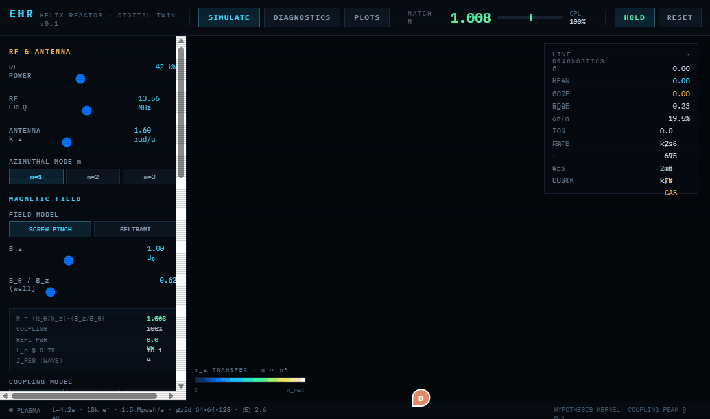
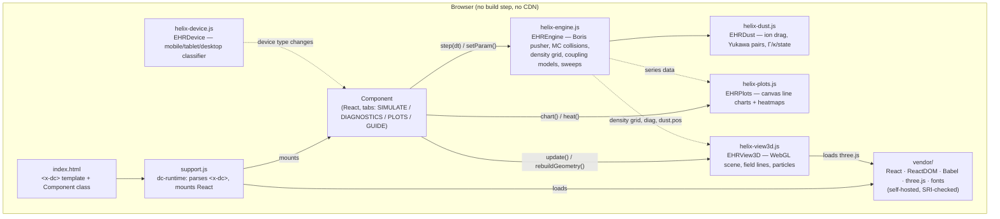

# EHR — Electromagnetic Helix Reactor

A reduced-physics **browser-native simulator for a helical-antenna plasma reactor**: ~18k macro-electrons pushed through an analytic magnetic field with a Boris integrator, Monte-Carlo collisions with neutral gas, a live 3D render, synthetic diagnostics, and a dusty-plasma (plasma crystal) module.

> The word *twin* is used here only in the modelling sense, and sparingly. Nothing in this repository mirrors an instrumented physical device — no reactor has been built. A telemetry-backed twin is a different thing, and this is not it.

The question under test: an RF antenna launches a helical wave with pitch `k_θ/k_z`; the magnetic field lines twist with pitch `B_θ/B_z`. The **match number `M = (k_θ/k_z)·(B_z/B_θ)`** compares them. Hypothesis: coupling peaks when the two helices align, `M ≈ 1`. You can bake that in as a prior (KERNEL), or force it to emerge — or fail — from geometry alone (EMERGENT, WAVE).



## Paper

This simulator is the companion instrument for the paper **"Electromagnetic Helix Reactor (EHR): A Multi-Physics Plasma Control Architecture for Advanced Plasma Processing"** (Zachary Auerbach, ORCID [0009-0001-3046-9104](https://orcid.org/0009-0001-3046-9104)). LaTeX source: [`paper/ehr-paper.tex`](paper/ehr-paper.tex). It is an unpublished preprint — no DOI, not peer reviewed — and its four predictions are proposals to be tested, not results.

The paper grounds the proposed operating regime in Hall-parameter estimates (the B–p regime map is generated by [`paper/figures/regime_map.py`](paper/figures/regime_map.py)) and defines **four falsifiable predictions**: the m=1 helicon mode is measurable on a B-dot array, the helicon resonance produces a density peak, acoustic drive imprints on the plasma density, and pitch scans at constant |B| and power change the coupling. The simulator's DIAGNOSTICS instruments and M/f sweeps mirror those predictions one-for-one.

<!-- PARKED FOR REVIEW - znatodos section 0.4 - NOT LIVE (hidden on GitHub).
     This is YOUR physics, summarised from sim/README.md by Claude.
     Check every number against your own tables before publishing.
     Delete this line and the PARKED-PHYSICS-END marker to publish.

A plain-language introduction to the central question — *can magnetic field-line pitch become a control variable?* — is published as [a write-up dated 2026-07-19](https://www.linkedin.com/pulse/new-question-plasma-physics-can-magnetic-field-line-pitch-auerbach-cqrgc/). Read the verdict below before the write-up: the simulator has since answered that question, and the answer is not the one the write-up anticipates.

## Where the predictions stand

**The simulator did not confirm the concept paper. It falsified the strong form of Prediction 4 and replaced it with a sharper claim.** Full derivations, tables and caveats live in [`sim/README.md`](sim/README.md); the short version:

- **Phase 1 (test particles).** Electron confinement rose from ~1.0 µs to ~2.8 µs as B_θ/B_z went 0 → 3 at fixed 100 G, 10 mTorr, Te = 3 eV — a 2.8× pitch gain, backed by a validated geometric transport law.
- **Phase 3 (self-consistent fields).** Adding an axisymmetric Poisson solver and electron feedback grows a Te-scale ambipolar well (~11.5 V ≈ 3.8 Te). Confinement rises to ~30 µs, but **the pitch gain collapses to ~1.15×**, because the well depth is set by charge balance rather than field geometry.
- **The Hall crossover (the decisive test).** The obvious rescue was that ions are unmagnetized at 100 G (H_i ≈ 0.2) and therefore pitch-blind, so pitch control should switch on above H_i ≈ 1. A corrected scan swept H_i* = 0.29 → 0.59 → 1.17 → 2.35. The gain **declined monotonically**: 1.15 → 1.12 → 1.05 → **0.97**. Crossing ion magnetization did not restore the advantage. Magnetized-ion geometry *did* engage — ion survival started preferring high pitch (71.5% → 78.1%) — but ambipolar coupling converted that into a shallower well and faster electron radial drain instead of net confinement.
- **Phase 3C (sustained discharge).** In true steady state with a particle source and an enforced wall-flux balance, bulk confinement is **pitch-flat**: +9% at H_i* = 0.18, +2% at H_i* = 2.35.

**Thesis:** self-consistent electric fields reduce the pitch dependence of bulk confinement from the ≈2.8× that test-particle transport predicts to ≤1.1× in sustained steady state, on both sides of the ion-magnetization boundary. What pitch robustly controls is *distribution* — which loss channel, which species, which radius carries the flux, and where the trapped density sits (the equilibrium density peak moves outward by 36% at H_i* = 2.35). **Pitch looks like a profile-control parameter, not a confinement-control parameter.** For plasma processing, where uniformity is the deliverable, that may be the more useful knob — but it is a different claim than the concept paper implies, and paper #2 has to say so.

Scope of that verdict: it covers the **transport pathway only**. The model contains no RF heating, so pitch-dependent power deposition (Predictions 1–2) remains an open route to bulk effects — that is what a Phase 4 coupling model is for.

A secondary correction the study produced: the argon H_i* = 1 crossing sits near **3.7 kG at 10 mTorr**, not the ~530 G the simple Hall-parameter argument gave (and near 1.1 kG at 3 mTorr — pressure is part of the design space). The 530 G figure appears in earlier write-ups and in the paper's regime discussion; treat it as superseded.

PARKED-PHYSICS-END -->

## Getting started

Everything here runs from a plain clone with **no install step** — the only prerequisite is a recent [Node.js](https://nodejs.org) (used to serve the app and run the research simulator; there is no `npm install`). All browser dependencies are vendored, so the app itself runs offline; the one network touch is `npx` fetching the tiny static-server package the first time you run `npm run dev` (any other static server — `python -m http.server`, etc. — works too).

**1. Play with the interactive digital twin** (five minutes):

```bash
npm run dev        # → http://localhost:5173
```

Open the **SIMULATE** tab, drag to orbit the chamber, and move the field-twist and RF sliders to watch the plasma respond. The in-app **GUIDE** tab is a full operator's manual. A good first experiment: go to **PLOTS**, sweep `M`, and see the coupling peak near `M ≈ 1` — then switch the coupling model from KERNEL to EMERGENT and sweep again to see whether the peak *emerges* from geometry instead of being assumed.

**2. Read the paper** — the source of truth is [`paper/ehr-paper.tex`](paper/ehr-paper.tex); build it with [tectonic](https://tectonic-typesetting.github.io):

```bash
tectonic paper/ehr-paper.tex     # -> paper/ehr-paper.pdf
```

It defines the architecture, the operating regime, and the four predictions everything else tests. **No PDF is committed** — a checked-in binary silently drifts from the source that generated it, which is exactly what happened here. Build it when you want it; the output is gitignored.

**3. Run the research simulator** — unlike the browser toy, [`sim/`](sim/README.md) is a headless SI-units transport code with real argon cross sections and absorbing walls:

```bash
npm run sim:selftest   # verify the physics kernel first (~15 s, 10 checks, all PASS)
npm run sim:pitch      # the headline study: confinement time vs field-line pitch
```

Results print as a console table and land in `sim/output/*.csv`. Then read [`sim/README.md`](sim/README.md) — it documents the full research arc: the pitch→confinement transport law and its out-of-sample validation (`sim:mechanism`, `sim:alpha`), the pitch-profile map, loss topology, and the self-consistent ambipolar studies (`sim:ambipolar`).

**4. Go deeper** — the [Architecture](#architecture) section below maps the app internals file-by-file; every runner in `sim/` takes `--key=value` flags documented in [`sim/README.md`](sim/README.md); and all runs are seeded, so any number in the write-ups can be reproduced exactly.

## Features

- **SIMULATE** — live 3D vessel (Three.js): field lines, electron cloud, density volume raymarch, isosurfaces, antenna, dust, wafer chuck. Drag to orbit, wheel to zoom.
- **DIAGNOSTICS** — six synthetic instruments: virtual Langmuir probes (core/edge density + radial profile), turbulence proxy (δn/n + Hann PSD), an 8-probe B-dot array that recovers the azimuthal mode via DFT, a synthetic GPI camera, axial structure vs. acoustic drive, and a wafer/dust panel with pair-correlation g(r).
- **PLOTS** — sweep `M` or RF frequency and trace the coupling response; overlay up to 4 stored runs color-coded by coupling model; export everything to CSV.
- **GUIDE** — a full in-app operator's manual.
- Three coupling models (**KERNEL** / **EMERGENT** / **WAVE**) so you can compare a hand-tuned prior against physics derived from `k̂·B̂` alignment and a helicon eigenmode.
- A dusty-plasma module: charged grains with ion drag, Yukawa pair interactions, and a gas → liquid → crystal transition driven by the coupling parameter Γ.

## Architecture

This is a **static, no-build, single-page app** — there's no bundler or server. `index.html` embeds a small custom component template (`<x-dc>`) that `support.js` (the "dc-runtime") parses and mounts as a React component. React/ReactDOM/Babel, three.js, and the IBM Plex Mono font are all **self-hosted from [`vendor/`](vendor/)** (version-pinned, SRI-checked), so the app runs fully offline — no CDN required. The physics engine, dust module, chart helpers, and 3D view are plain global-scope scripts loaded as `<script>` tags — no imports, no `node_modules` at runtime.


```mermaid
flowchart TD
    subgraph Browser["Browser (no build step, no CDN)"]
        HTML["index.html<br/>&lt;x-dc&gt; template + Component class"]
        Runtime["support.js<br/>dc-runtime: parses &lt;x-dc&gt;, mounts React"]
        Vendor["vendor/<br/>React · ReactDOM · Babel · three.js · fonts<br/>(self-hosted, SRI-checked)"]
        Comp["Component<br/>(React, tabs: SIMULATE / DIAGNOSTICS / PLOTS / GUIDE)"]
        Engine["helix-engine.js<br/>EHREngine — Boris pusher, MC collisions,<br/>density grid, coupling models, sweeps"]
        Dust["helix-dust.js<br/>EHRDust — ion drag, Yukawa pairs, Γ/κ/state"]
        Plots["helix-plots.js<br/>EHRPlots — canvas line charts + heatmaps"]
        View["helix-view3d.js<br/>EHRView3D — WebGL scene, field lines, particles"]
        Device["helix-device.js<br/>EHRDevice — mobile/tablet/desktop classifier"]

        HTML --> Runtime
        Runtime -- "loads" --> Vendor
        Runtime -- "mounts" --> Comp
        Comp -- "step(dt) / setParam()" --> Engine
        Engine --> Dust
        Comp -- "chart() / heat()" --> Plots
        Comp -- "update() / rebuildGeometry()" --> View
        View -- "loads three.js" --> Vendor
        Engine -. "density grid, diag, dust.pos" .-> View
        Engine -. "series data" .-> Plots
        Device -. "device type changes" .-> Comp
    end
```

| File | Role |
|---|---|
| [`index.html`](index.html) | Page shell, `<x-dc>` template (all UI markup), and the `Component` class (React logic: tabs, sliders, presets, sweep/export handlers, per-tab draw loop). |
| [`support.js`](support.js) | Generated dc-runtime bundle — parses the `<x-dc>` template/expression bindings (`{{ }}`, `sc-for`, `sc-if`), loads React/ReactDOM/Babel from [`vendor/`](vendor/), and boots the component standalone. |
| [`helix-engine.js`](helix-engine.js) | The physics core: Boris-pushed electrons, Monte-Carlo ionization/collisions, 64×64×128 density grid, screw-pinch/Beltrami field models, KERNEL/EMERGENT/WAVE coupling, parameter sweeps. |
| [`helix-dust.js`](helix-dust.js) | Dusty-plasma module: ion drag from the live density gradient, Yukawa pair forces, pair-correlation g(r), Γ/κ diagnostics and gas/liquid/crystal state. |
| [`helix-plots.js`](helix-plots.js) | Tiny dependency-free canvas plotting library (line charts, heatmaps) used by every diagnostic pane. |
| [`helix-view3d.js`](helix-view3d.js) | Three.js scene: chamber, antenna helix, field lines, electron point cloud, density volume raymarch, dust, wafer chuck, orbit camera. |
| [`helix-device.js`](helix-device.js) | `EHRDevice` — classifies the viewport as mobile/tablet/desktop from size + pointer capability (not UA sniffing) and notifies subscribers on change; drives the responsive rail drawer and auto particle-count capping. |
| [`sim/`](sim/README.md) | **Phase 1 research simulator** (headless Node, SI units): Boris pusher + Monte-Carlo collisions with absorbing walls, built to measure confinement time vs. field-line pitch at fixed \|B\| — the quantitative test of Prediction 4. Separate from the browser engine above; see [`sim/README.md`](sim/README.md) for physics, self-tests, and first results. |

## Running locally

No install, no build — just serve the directory statically (opening `index.html` via `file://` won't work because the browser blocks the module scripts' cross-origin fetches):

```bash
npm run dev
# → serves on http://localhost:5173
```

or with any other static server (`python -m http.server`, `npx serve`, etc.).

## Deploying to Vercel

This repo is ready to deploy as-is — it's a static site with a `vercel.json` (clean URLs, JS cache headers) already in place.

```bash
npx vercel        # preview deploy
npx vercel --prod # production deploy
```

Or connect the repo in the [Vercel dashboard](https://vercel.com/new) — no framework preset or build command needed; the default static output works out of the box.

## Notes & known limitations

- Reduced/normalized-unit model — analytic fields, macro-particles, a coarse 64×64×128 grid. Trust trends and comparisons between settings, not absolute values.
- All runtime dependencies (React, ReactDOM, Babel standalone, three.js, IBM Plex Mono) are pinned and self-hosted in [`vendor/`](vendor/) — the app works with no internet access. To upgrade one, replace the file and update the matching SRI hash in `support.js`.
- [`.gitattributes`](.gitattributes) marks `vendor/**` as `-text` so checkouts stay byte-exact on every platform — the SRI hashes are computed over exact bytes, and line-ending conversion (e.g. `core.autocrlf` on Windows) would otherwise corrupt them and block the app from booting locally.

## Citing this work

Zachary Auerbach · ORCID [0009-0001-3046-9104](https://orcid.org/0009-0001-3046-9104) · Aurelius Dynamic

[`CITATION.cff`](CITATION.cff) carries the machine-readable metadata — GitHub renders it as **Cite this repository** in the sidebar, and it covers both this simulator and the companion paper. Cite the paper for the architecture and the four predictions; cite the repository for the simulator, the headless transport code in [`sim/`](sim/README.md), or any number reproduced from a seeded run.

## License

MIT — see [LICENSE](LICENSE).
